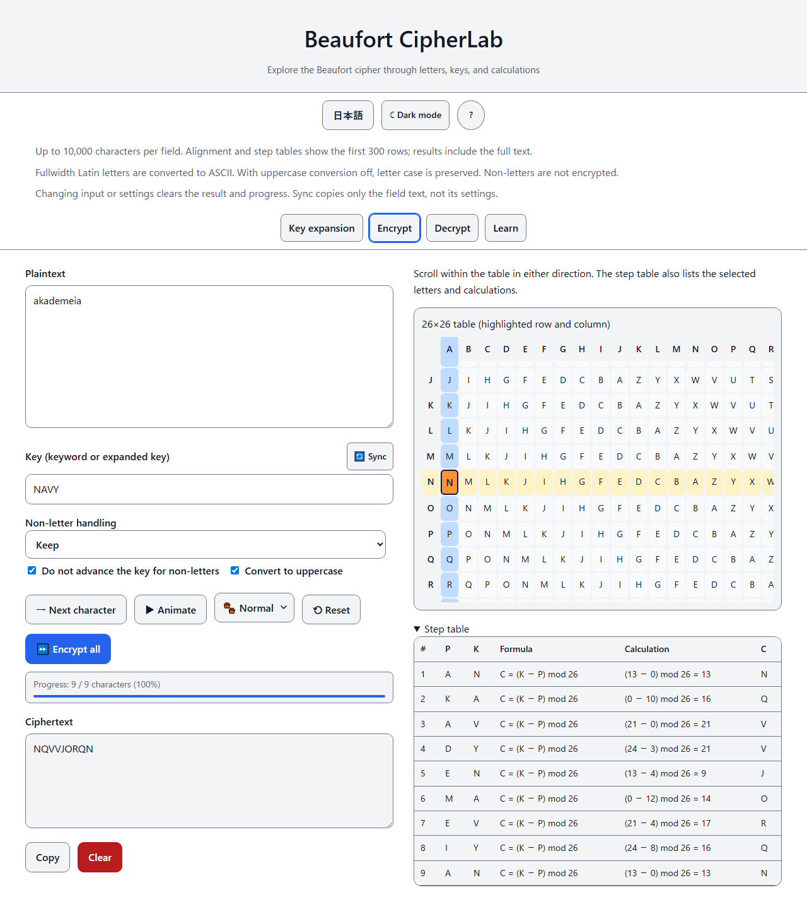
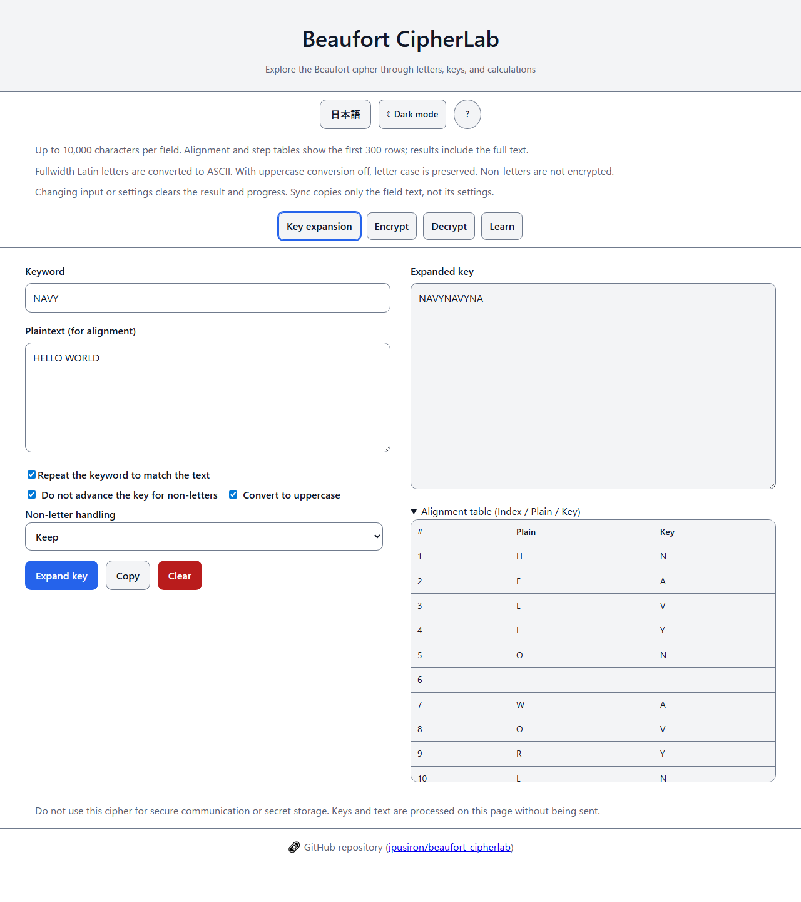
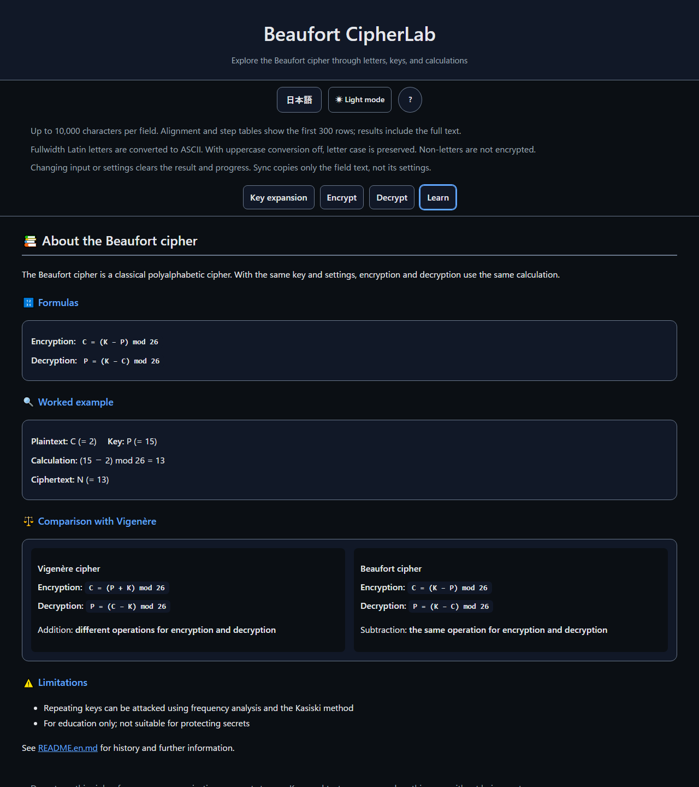

English · [日本語](README.md)

# Beaufort CipherLab - Beaufort Cipher Learning Tool


[](https://ipusiron.github.io/beaufort-cipherlab/)

**Day078 - 100 Security Tools with Generative AI**

Beaufort CipherLab is a web tool for learning and exploring the classical Beaufort cipher (the pure form).

It visualizes key expansion, encryption, and decryption and explains how Beaufort differs from Vigenère.
Animations demonstrate the reciprocal property: encryption and decryption use the same form of calculation.

---

## 🌐 Demo

👉 [Open Beaufort CipherLab](https://ipusiron.github.io/beaufort-cipherlab/?lang=en)

Try it directly in your browser.

---

## 📸 Screenshots


> *Encrypting akademeia with key NAVY to obtain NQVVJORQN.*


> *Checking the key positions for HELLO WORLD without advancing the key at the space.*


> *Comparing encryption and decryption formulas with Vigenère.*

---

## 🔐 The Beaufort cipher

Beaufort is a classical polyalphabetic cipher: the key letter selects the substitution alphabet.
This tool uses `C = (K - P) mod 26`; encryption and decryption use the same key and settings.
It is for education, not secret storage or secure communication.

### Historical background

The cipher is named after Admiral Francis Beaufort.
Helen Fouché Gaines's *Elementary Cryptanalysis* (1939) distinguishes “true Beaufort” from “variant Beaufort” by the direction in which the same tableau is read.
“Pure” in this tool means the former, not a claim of historical superiority.
See the [original tables and worked examples](https://www.gutenberg.org/files/75074/75074-h/75074-h.htm).

### Japanese spellings of Beaufort

The English name is “Beaufort cipher.”
Japanese sources use both ビューフォート暗号 and ボーフォート暗号; this tool consistently uses the former in its Japanese interface.

---

## ⚙️ How the Beaufort cipher works

Plaintext, key, and ciphertext are aligned one character at a time.
Letters are numbered from A=0 to Z=25.

- P: one plaintext letter
- K: one key letter, taken from the keyword repeated as needed
- C: one ciphertext letter

For the keyword `PACIFIC` and 20 plaintext letters, the expanded key is `PACIFICPACIFICPACIFI`.
Whether punctuation and spaces advance the key depends on the selected setting.

### Using Table A

This table contains shifted copies of the normal alphabet.
A is repeated at the edges, giving 27 letters in each direction.
It is read differently from Table B, which the interface uses.

- Find plaintext P on the left edge
- Follow its row to key K
- Read ciphertext C from the top of that column
- When the plaintext and key are equal, either edge gives A at the top

| A | B | C | D | E | F | G | H | I | J | K | L | M | N | O | P | Q | R | S | T | U | V | W | X | Y | Z | A |
|---|---|---|---|---|---|---|---|---|---|---|---|---|---|---|---|---|---|---|---|---|---|---|---|---|---|---|
| B | C | D | E | F | G | H | I | J | K | L | M | N | O | P | Q | R | S | T | U | V | W | X | Y | Z | A | B |
| C | D | E | F | G | H | I | J | K | L | M | N | O | P | Q | R | S | T | U | V | W | X | Y | Z | A | B | C |
| D | E | F | G | H | I | J | K | L | M | N | O | P | Q | R | S | T | U | V | W | X | Y | Z | A | B | C | D |
| E | F | G | H | I | J | K | L | M | N | O | P | Q | R | S | T | U | V | W | X | Y | Z | A | B | C | D | E |
| F | G | H | I | J | K | L | M | N | O | P | Q | R | S | T | U | V | W | X | Y | Z | A | B | C | D | E | F |
| G | H | I | J | K | L | M | N | O | P | Q | R | S | T | U | V | W | X | Y | Z | A | B | C | D | E | F | G |
| H | I | J | K | L | M | N | O | P | Q | R | S | T | U | V | W | X | Y | Z | A | B | C | D | E | F | G | H |
| I | J | K | L | M | N | O | P | Q | R | S | T | U | V | W | X | Y | Z | A | B | C | D | E | F | G | H | I |
| J | K | L | M | N | O | P | Q | R | S | T | U | V | W | X | Y | Z | A | B | C | D | E | F | G | H | I | J |
| K | L | M | N | O | P | Q | R | S | T | U | V | W | X | Y | Z | A | B | C | D | E | F | G | H | I | J | K |
| L | M | N | O | P | Q | R | S | T | U | V | W | X | Y | Z | A | B | C | D | E | F | G | H | I | J | K | L |
| M | N | O | P | Q | R | S | T | U | V | W | X | Y | Z | A | B | C | D | E | F | G | H | I | J | K | L | M |
| N | O | P | Q | R | S | T | U | V | W | X | Y | Z | A | B | C | D | E | F | G | H | I | J | K | L | M | N |
| O | P | Q | R | S | T | U | V | W | X | Y | Z | A | B | C | D | E | F | G | H | I | J | K | L | M | N | O |
| P | Q | R | S | T | U | V | W | X | Y | Z | A | B | C | D | E | F | G | H | I | J | K | L | M | N | O | P |
| Q | R | S | T | U | V | W | X | Y | Z | A | B | C | D | E | F | G | H | I | J | K | L | M | N | O | P | Q |
| R | S | T | U | V | W | X | Y | Z | A | B | C | D | E | F | G | H | I | J | K | L | M | N | O | P | Q | R |
| S | T | U | V | W | X | Y | Z | A | B | C | D | E | F | G | H | I | J | K | L | M | N | O | P | Q | R | S |
| T | U | V | W | X | Y | Z | A | B | C | D | E | F | G | H | I | J | K | L | M | N | O | P | Q | R | S | T |
| U | V | W | X | Y | Z | A | B | C | D | E | F | G | H | I | J | K | L | M | N | O | P | Q | R | S | T | U |
| V | W | X | Y | Z | A | B | C | D | E | F | G | H | I | J | K | L | M | N | O | P | Q | R | S | T | U | V |
| W | X | Y | Z | A | B | C | D | E | F | G | H | I | J | K | L | M | N | O | P | Q | R | S | T | U | V | W |
| X | Y | Z | A | B | C | D | E | F | G | H | I | J | K | L | M | N | O | P | Q | R | S | T | U | V | W | X |
| Y | Z | A | B | C | D | E | F | G | H | I | J | K | L | M | N | O | P | Q | R | S | T | U | V | W | X | Y |
| Z | A | B | C | D | E | F | G | H | I | J | K | L | M | N | O | P | Q | R | S | T | U | V | W | X | Y | Z |
| A | B | C | D | E | F | G | H | I | J | K | L | M | N | O | P | Q | R | S | T | U | V | W | X | Y | Z | A |

For plaintext `C` (2) and key `P` (15), the top letter is `N` (13).
The calculation is also `(15 - 2) mod 26 = 13`.

### Using Table B

The interface uses this table.
The row is key K, the column is input letter P, and their intersection is ciphertext C.
Row A starts `A Z Y X … B`, and every row starts with its key letter.

|   | A | B | C | D | E | F | G | H | I | J | K | L | M | N | O | P | Q | R | S | T | U | V | W | X | Y | Z |
|---|---|---|---|---|---|---|---|---|---|---|---|---|---|---|---|---|---|---|---|---|---|---|---|---|---|---|
| A | A | Z | Y | X | W | V | U | T | S | R | Q | P | O | N | M | L | K | J | I | H | G | F | E | D | C | B |
| B | B | A | Z | Y | X | W | V | U | T | S | R | Q | P | O | N | M | L | K | J | I | H | G | F | E | D | C |
| C | C | B | A | Z | Y | X | W | V | U | T | S | R | Q | P | O | N | M | L | K | J | I | H | G | F | E | D |
| D | D | C | B | A | Z | Y | X | W | V | U | T | S | R | Q | P | O | N | M | L | K | J | I | H | G | F | E |
| E | E | D | C | B | A | Z | Y | X | W | V | U | T | S | R | Q | P | O | N | M | L | K | J | I | H | G | F |
| F | F | E | D | C | B | A | Z | Y | X | W | V | U | T | S | R | Q | P | O | N | M | L | K | J | I | H | G |
| G | G | F | E | D | C | B | A | Z | Y | X | W | V | U | T | S | R | Q | P | O | N | M | L | K | J | I | H |
| H | H | G | F | E | D | C | B | A | Z | Y | X | W | V | U | T | S | R | Q | P | O | N | M | L | K | J | I |
| I | I | H | G | F | E | D | C | B | A | Z | Y | X | W | V | U | T | S | R | Q | P | O | N | M | L | K | J |
| J | J | I | H | G | F | E | D | C | B | A | Z | Y | X | W | V | U | T | S | R | Q | P | O | N | M | L | K |
| K | K | J | I | H | G | F | E | D | C | B | A | Z | Y | X | W | V | U | T | S | R | Q | P | O | N | M | L |
| L | L | K | J | I | H | G | F | E | D | C | B | A | Z | Y | X | W | V | U | T | S | R | Q | P | O | N | M |
| M | M | L | K | J | I | H | G | F | E | D | C | B | A | Z | Y | X | W | V | U | T | S | R | Q | P | O | N |
| N | N | M | L | K | J | I | H | G | F | E | D | C | B | A | Z | Y | X | W | V | U | T | S | R | Q | P | O |
| O | O | N | M | L | K | J | I | H | G | F | E | D | C | B | A | Z | Y | X | W | V | U | T | S | R | Q | P |
| P | P | O | N | M | L | K | J | I | H | G | F | E | D | C | B | A | Z | Y | X | W | V | U | T | S | R | Q |
| Q | Q | P | O | N | M | L | K | J | I | H | G | F | E | D | C | B | A | Z | Y | X | W | V | U | T | S | R |
| R | R | Q | P | O | N | M | L | K | J | I | H | G | F | E | D | C | B | A | Z | Y | X | W | V | U | T | S |
| S | S | R | Q | P | O | N | M | L | K | J | I | H | G | F | E | D | C | B | A | Z | Y | X | W | V | U | T |
| T | T | S | R | Q | P | O | N | M | L | K | J | I | H | G | F | E | D | C | B | A | Z | Y | X | W | V | U |
| U | U | T | S | R | Q | P | O | N | M | L | K | J | I | H | G | F | E | D | C | B | A | Z | Y | X | W | V |
| V | V | U | T | S | R | Q | P | O | N | M | L | K | J | I | H | G | F | E | D | C | B | A | Z | Y | X | W |
| W | W | V | U | T | S | R | Q | P | O | N | M | L | K | J | I | H | G | F | E | D | C | B | A | Z | Y | X |
| X | X | W | V | U | T | S | R | Q | P | O | N | M | L | K | J | I | H | G | F | E | D | C | B | A | Z | Y |
| Y | Y | X | W | V | U | T | S | R | Q | P | O | N | M | L | K | J | I | H | G | F | E | D | C | B | A | Z |
| Z | Z | Y | X | W | V | U | T | S | R | Q | P | O | N | M | L | K | J | I | H | G | F | E | D | C | B | A |

For decryption, select ciphertext C as the column and read plaintext P at the intersection.
For example, key A maps plaintext B to Z; applying key A to Z returns B.

### Vigenère table (reference)

For Vigenère, read the intersection of the key row and plaintext column.
Each cell in this table is `(K + P) mod 26`.

|   | A | B | C | D | E | F | G | H | I | J | K | L | M | N | O | P | Q | R | S | T | U | V | W | X | Y | Z |
|---|---|---|---|---|---|---|---|---|---|---|---|---|---|---|---|---|---|---|---|---|---|---|---|---|---|---|
| A | A | B | C | D | E | F | G | H | I | J | K | L | M | N | O | P | Q | R | S | T | U | V | W | X | Y | Z |
| B | B | C | D | E | F | G | H | I | J | K | L | M | N | O | P | Q | R | S | T | U | V | W | X | Y | Z | A |
| C | C | D | E | F | G | H | I | J | K | L | M | N | O | P | Q | R | S | T | U | V | W | X | Y | Z | A | B |
| D | D | E | F | G | H | I | J | K | L | M | N | O | P | Q | R | S | T | U | V | W | X | Y | Z | A | B | C |
| E | E | F | G | H | I | J | K | L | M | N | O | P | Q | R | S | T | U | V | W | X | Y | Z | A | B | C | D |
| F | F | G | H | I | J | K | L | M | N | O | P | Q | R | S | T | U | V | W | X | Y | Z | A | B | C | D | E |
| G | G | H | I | J | K | L | M | N | O | P | Q | R | S | T | U | V | W | X | Y | Z | A | B | C | D | E | F |
| H | H | I | J | K | L | M | N | O | P | Q | R | S | T | U | V | W | X | Y | Z | A | B | C | D | E | F | G |
| I | I | J | K | L | M | N | O | P | Q | R | S | T | U | V | W | X | Y | Z | A | B | C | D | E | F | G | H |
| J | J | K | L | M | N | O | P | Q | R | S | T | U | V | W | X | Y | Z | A | B | C | D | E | F | G | H | I |
| K | K | L | M | N | O | P | Q | R | S | T | U | V | W | X | Y | Z | A | B | C | D | E | F | G | H | I | J |
| L | L | M | N | O | P | Q | R | S | T | U | V | W | X | Y | Z | A | B | C | D | E | F | G | H | I | J | K |
| M | M | N | O | P | Q | R | S | T | U | V | W | X | Y | Z | A | B | C | D | E | F | G | H | I | J | K | L |
| N | N | O | P | Q | R | S | T | U | V | W | X | Y | Z | A | B | C | D | E | F | G | H | I | J | K | L | M |
| O | O | P | Q | R | S | T | U | V | W | X | Y | Z | A | B | C | D | E | F | G | H | I | J | K | L | M | N |
| P | P | Q | R | S | T | U | V | W | X | Y | Z | A | B | C | D | E | F | G | H | I | J | K | L | M | N | O |
| Q | Q | R | S | T | U | V | W | X | Y | Z | A | B | C | D | E | F | G | H | I | J | K | L | M | N | O | P |
| R | R | S | T | U | V | W | X | Y | Z | A | B | C | D | E | F | G | H | I | J | K | L | M | N | O | P | Q |
| S | S | T | U | V | W | X | Y | Z | A | B | C | D | E | F | G | H | I | J | K | L | M | N | O | P | Q | R |
| T | T | U | V | W | X | Y | Z | A | B | C | D | E | F | G | H | I | J | K | L | M | N | O | P | Q | R | S |
| U | U | V | W | X | Y | Z | A | B | C | D | E | F | G | H | I | J | K | L | M | N | O | P | Q | R | S | T |
| V | V | W | X | Y | Z | A | B | C | D | E | F | G | H | I | J | K | L | M | N | O | P | Q | R | S | T | U |
| W | W | X | Y | Z | A | B | C | D | E | F | G | H | I | J | K | L | M | N | O | P | Q | R | S | T | U | V |
| X | X | Y | Z | A | B | C | D | E | F | G | H | I | J | K | L | M | N | O | P | Q | R | S | T | U | V | W |
| Y | Y | Z | A | B | C | D | E | F | G | H | I | J | K | L | M | N | O | P | Q | R | S | T | U | V | W | X |
| Z | Z | A | B | C | D | E | F | G | H | I | J | K | L | M | N | O | P | Q | R | S | T | U | V | W | X | Y |

### Formulas

- Encryption: `C = (K - P) mod 26`
- Decryption: `P = (K - C) mod 26`

With the same K, `K - (K - P) = P`.
However, removed non-letters and original letter case lost through uppercase conversion cannot be restored.

---

## 🔢 Polyalphabetic substitution and Beaufort

The same plaintext letter can produce different output when paired with different key letters.
Each key letter selects a reversed alphabet; distinguish this from ordinary Caesar-shift addition.
Repeating short keys introduce periodicity, which can be investigated with frequency analysis and the Kasiski method.
A longer key alone does not guarantee modern security.

## 📐 Beaufort formulas

This tool encrypts with `K - P` and decrypts with `K - C`, both modulo 26.
Variant Beaufort, which encrypts with `P - K`, is not implemented.

### Vigenère and Beaufort

Distinguishing addition from the two subtraction orders explains the three methods.

| Method | Encryption | Decryption |
|---|---|---|
| Vigenère | (P + K) mod 26 | (C - K) mod 26 |
| Beaufort | (K - P) mod 26 | (K - C) mod 26 |
| Variant Beaufort | (P - K) mod 26 | (C + K) mod 26 |

### Vigenère characteristics

Add the key to plaintext to encrypt; subtract the key from ciphertext to decrypt.

### Beaufort characteristics

Subtract the input letter from the key for both encryption and decryption.

### Practical differences

Using the same procedure is convenient for learning and manual calculation, but does not guarantee stronger encryption.
This tool does not measure error rates or security.

---

## 🖥️ Interface tabs

1. Key expansion: repeat the keyword and show its alignment with the plaintext
2. Encrypt: process all text, step one character at a time, or animate
3. Decrypt: use the same formula and display the key row and ciphertext column
4. Learn: formulas, a worked example, comparison with Vigenère, and limitations

The expanded-key field does not include alignment gaps.
The alignment table leaves the key cell empty where a non-letter does not advance the key.
With “Repeat the keyword to match the text” off, expansion stops after the normalized keyword's length.
An empty plaintext displays the normalized keyword once.

Sync copies only the field text.
It does not copy other tabs' settings: use the same non-letter handling and key advancement when encrypting and decrypting.
Changing input or settings, or syncing a field, clears that tab's result and progress.
Clear removes the tab's input and result, but does not clear a copied clipboard value.
Switching tabs, hiding the page, opening help, or switching languages pauses playback.

---

## 📋 Detailed specifications

### Common behavior

- Supported letters: A–Z and a–z; fullwidth Latin letters are converted to ASCII
- Uppercase conversion on: convert ASCII letters to uppercase
- Uppercase conversion off: preserve each input letter's case in the output
- Keep non-letters: retain spaces, newlines, Japanese text, emoji, and other non-letters unchanged
- Remove non-letters: process letters only
- Keep ASCII spaces only: process letters and U+0020 spaces; remove newlines, tabs, and fullwidth spaces
- Key: convert fullwidth Latin letters to ASCII, then keep letters only and uppercase them; reject keys with no letters
- Key advancement: apply to normalized input; optionally advance at retained non-letters
- Length: up to 10,000 Unicode code points per input field; reject longer input without truncation
- Results: display and copy the full result; no .txt download feature
- Storage: only language and theme are saved in localStorage; the tool works when storage is unavailable
- Language: `?lang=ja|en` → saved selection → browser language (English unless Japanese)
- Theme: use the saved selection, or the OS color preference when none is saved

### Visualization

- 26×26 table plus headers, scrolling within its frame and following the highlighted intersection
- An outline as well as color marks the intersection; the step table also shows the letters and calculation
- Alignment and step tables show the first 300 rows; the full result is not truncated
- Animation delay: slow 250ms, normal 120ms, fast 60ms; processing time affects the actual interval
- Bulk and step execution use the same calculated trace

### UI/UX

- Japanese/English and light/dark switches
- Tabs: Left/Right arrows, Home, and End; Tab moves to controls
- `Ctrl+Enter` / `Command+Enter`: process all text in the active Encrypt or Decrypt tab
- `Space`: play/pause; `→`: next character (when focus is not in a field, button, or other interactive control)
- `Esc`: close help; if help is closed, reset the active Encrypt or Decrypt tab
- `?`: open help (when focus is not in a field, button, or other interactive control)
- Copy failure is reported; the result can be selected and copied manually

---

## 🎓 Learning points

Applying key `P` to `C` gives `N`; applying the same key to `N` gives `C`.
Compare the row, column, intersection, and numeric calculation in the step table to check the subtraction order.

### Use cases

- Teaching: verify a manually calculated letter using both the table and formula
- Self-study: change case and non-letter options to explore what decryption can restore
- Puzzle creation: produce a short message with a known answer and key, then check it by decrypting
- Programming practice: test an implementation against the published calculation module and known answers
- Tool comparison: use the same input and key with Vigenère to examine the different operations

### Known-answer examples

These results use non-letter removal and uppercase conversion.

| Plaintext | Key | Ciphertext |
|---|---|---|
| C | P | N |
| AK ADEMEIA | NAVY | NQVVJORQN |
| DCODE | KEY | HCKHA |
| CEQUALSKMINUSP | RECIPROCAL | PAMOPGWSODEKKT |
| SENDSUPPLIES | COMET | KKZBBIZXTLYW |

`DCODE` comes from [dCode's example](https://www.dcode.fr/beaufort-cipher), `CEQUALSKMINUSP` from the [ACA sheet](https://www.cryptogram.org/downloads/aca.info/ciphers/Beaufort.pdf), and `SENDSUPPLIES` from Gaines.
Automated tests check every table cell and these known answers.

## 🔒 Security and limitations

Text and keys are processed on this page without being transmitted or saved.
The CSP directive `connect-src 'none'` restricts connections from the page, and no external libraries are loaded.
This does not protect input from browser extensions or other users of a shared device.
Do not enter secret information into this classical-cipher tool.

On GitHub Pages, HTML meta tags cannot enforce a prohibition on framing.
If that control is required, use hosting that supports configurable HTTP response headers.

## 📚 References

- [Helen Fouché Gaines, *Elementary Cryptanalysis* (1939)](https://www.gutenberg.org/files/75074/75074-h/75074-h.htm): Beaufort and Variant tables, reading procedures, and worked examples
- [American Cryptogram Association, *Beaufort*](https://www.cryptogram.org/downloads/aca.info/ciphers/Beaufort.pdf): key repetition and a known answer
- [Ole Immanuel Franksen, “Babbage and cryptography. Or, the mystery of Admiral Beaufort's cipher” (1993), 35(4), 327–367](https://doi.org/10.1016/0378-4754(93)90063-Z): research on Babbage's cryptanalysis and his relationship with Beaufort

The bibliographic details and public abstract of Franksen's paper were checked.
The paper's full text is not used here as evidence establishing the cipher's inventor.

## 🔗 Related resources

- [Vigenere Cipher Tool (Day017)](https://ipusiron.github.io/vigenere-cipher-tool/): a separate tool for trying Vigenère; no automatic input transfer
- [dCode Beaufort](https://www.dcode.fr/beaufort-cipher): a separate tool with cipher variants and cryptanalysis
- [CrypTool Beaufort](https://legacy.cryptool.org/en/cto/beaufort): a separate tool with configurable alphabets and non-letter handling

---


## 📁 Directory structure

```text
beaufort-cipherlab/
├── .github/workflows/test.yml
├── .nojekyll
├── index.html
├── LICENSE
├── README.md
├── README.en.md
├── CLAUDE.md
├── package.json
├── assets/
│   ├── screenshot.png
│   ├── screenshot-key.png
│   ├── screenshot-learn.png
│   └── en/
│       ├── screenshot.png
│       ├── screenshot-key.png
│       └── screenshot-learn.png
├── css/
│   └── style.css
├── js/
│   ├── preferences.js
│   ├── messages.js
│   ├── normalize.js
│   ├── beaufort.js
│   ├── visualize.js
│   ├── toaster.js
│   └── app.js
└── test/
    ├── core.test.js
    ├── ui.test.js
    └── readme.test.js
```

`normalize.js` handles normalization, `beaufort.js` calculations, `visualize.js` tables, and `app.js` interaction state.
`preferences.js` applies initial preferences and `messages.js` manages Japanese and English text.

## 💻 Running and testing

No build or dependency installation is required.
Open `index.html` directly in a browser, or serve it with a static HTTP server.

```sh
python -m http.server 8000
```

Run automated tests with Node.js 22 or later.

```sh
npm test
```

GitHub Actions also runs them on both push and pull_request.
HTTP and file:// operation have been checked in Chromium, Microsoft Edge, and Firefox.
Safari and physical smartphones have not been tested.
Clipboard access may be restricted by browser permissions or the way the page is opened.

## 📄 License

MIT License. See [LICENSE](LICENSE) for details.

---

## 🛠️ About this tool

This tool is part of the “100 Security Tools with Generative AI” project.
The project develops and publishes a variety of security-related tools over 100 days with assistance from generative AI.

Visit the following page for project details and other tools.

🔗 [100 Security Tools with Generative AI](https://akademeia.info/?page_id=42163)
