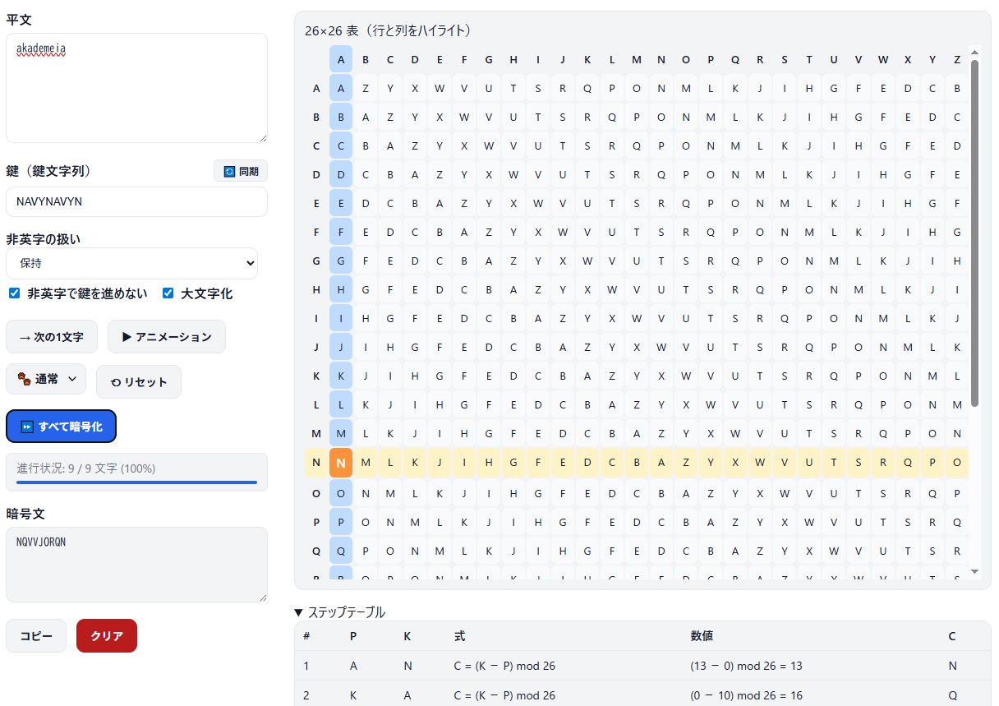

<!--
---
title: Beaufort CipherLab
category: classical-cryptography
difficulty: 2
description: Interactive web tool to learn and visualize the pure Beaufort cipher: key generation, encryption/decryption, and comparison with Vigenère.
tags: [beaufort, vigenere, cipher, classical-crypto, education, visualization, javascript]
demo: https://ipusiron.github.io/beaufort-cipherlab/
---
-->

# Beaufort CipherLab - ビューフォート暗号ツール


[](https://ipusiron.github.io/beaufort-cipherlab/)

**Day078 - 生成AIで作るセキュリティツール100**

**Beaufort CipherLab** は、古典暗号の一種である **ビューフォート暗号（純正版）** を学習・体験できるWebツールです。

鍵生成、暗号化、復号をインタラクティブに可視化し、ヴィジュネル暗号との違いを理解できます。
暗号化と復号で同じ形式の数式を使う自己逆関数的な性質をアニメーションで体感できます。

---

## 🌐 デモページ

👉 **[https://ipusiron.github.io/beaufort-cipherlab/](https://ipusiron.github.io/beaufort-cipherlab/)**

ブラウザーで直接お試しいただけます。

---

## 📸 スクリーンショット

>
>*平文"akademeia"を鍵キーワード"NAVY"で暗号化*

---

## 🔐 ビューフォート暗号

- ビューフォート提督によって開発された。
- 多表式暗号…同一の平文文字が別の暗号文文字に変換される、換字式暗号の一種。
- ヴィジュネル暗号とよく似た表（あるいは計算式）を使うが、表の読み方が変わる。
- 相互暗号のため、同じ操作で暗号化・復号化が可能。

### 歴史的背景

ボーフォート暗号の真の発明者は、1710年にイタリア人のGiovanni Sestri（ジョヴァンニ・セストリ）です。彼がこの暗号方式の原型となる仕組みを考案しましたが、その後長い間忘れ去られていました。

1710年にGiovanni Sestriがボーフォート暗号を発明した後、約1世紀以上の時を経て、19世紀前半に英王立海軍のFrancis Beaufort提督（フランシス・ビューフォート、1774-1857）がヴィジュネル暗号を研究する過程で、暗号アルファベットを逆順にした変種を独自に作成しました。
Beaufort提督は個人的な日記や手紙の暗号化にこの方式を使用しており、200通を超える暗号化された文書が残されています。

1857年にBeaufort提督が亡くなった後、その兄弟によって暗号方式がはじめて公に発表され、この時点で「ボーフォート暗号」として命名されました。提督自身は生前にこの暗号を公表することはなかったといいます。

暗号学の歴史ではビューフォート暗号でそこそこ有名な存在といえますが、暗号学自体を進歩させるような新しいものはありません。
しかしながら、折しも葉書や電信のために大衆が暗号を使い始めていた時期とも一致しています。
通信を秘匿する新しい方法として、ビューフォート暗号表（赤黒のアルファベットが印刷された4×5インチのカード）が6ペンスで売られました。

### ビューフォート vs. ボーフォート

ビューフォート暗号は英語で"Beaufort cipher"と表記されます。

"Beaufort"はノースカロライナの郡、マレーシアの町、北極海の一部では「ボーフォート」と読みます。
一方、サウスカロライナの郡は「ビューフォート」と読みます。

ビューフォート提督は風速の等級を示すビューフォート風力階級を考案しており、その呼び名に合わせて文献によっては「ビューフォート暗号」と採用されていることがあります。

ここでは「ビューフォート」と読むように統一しています。

---

## ⚙️ ビューフォート暗号の仕組み

ビューフォート暗号は、平文・鍵・暗号文の各文字ずつ処理されます。

ここでその各文字に以下の記号を割り当てます（本当はm_0,m_1,…のするのがよいのですが、見にくくなるので添え字をカットしています。

- <span style="color: blue; ">M</span>：平文文字、平文の1文字
- <span style="color: yellow; ">K</span>：鍵文字
  - 鍵キーワードによって拡張されて作られるのが鍵。その各文字が鍵文字。
  - 鍵キーワードは、使用者になじみ深い名前、地名、詩のフレーズなどが使われる。
    - 例：鍵キーワードが"PACIFIC"で、平文が20文字なら、連結していき鍵は"PACIFICPACIFICPACIFICPA"になる。
- <span style="color: red; ">C</span>：暗号文文字

### 表Aを使った説明

ビューフォート暗号表A（『暗号解読事典』で紹介されているバージョン）は、以下の構造を持ちます。

- 縦27文字、横27文字のアルファベットを順に配置する。
  - 27文字になっているのは、ステップ2で鍵文字を横に探すというやり方だと、0列目は使われないからである。とくに「鍵文字＝平文文字」だと、0列目にありますが仕組み上ここは使われず、26列目（最終列）がヒットする。
- 四隅には'A'が位置する。

| A | B | C | D | E | F | G | H | I | J | K | L | M | <span style="color: red; ">**N**</span> | O | P | Q | R | S | T | U | V | W | X | Y | Z | A |
|---|---|---|---|---|---|---|---|---|---|---|---|---|---|---|---|---|---|---|---|---|---|---|---|---|---|---|
| B | C | D | E | F | G | H | I | J | K | L | M | N | O | P | Q | R | S | T | U | V | W | X | Y | Z | A | B |
| <span style="color: blue; ">**C**</span> | D | E | F | G | H | I | J | K | L | M | N | O | <span style="color: yellow; ">**P**</span> | Q | R | S | T | U | V | W | X | Y | Z | A | B | C |
| D | E | F | G | H | I | J | K | L | M | N | O | P | Q | R | S | T | U | V | W | X | Y | Z | A | B | C | D |
| E | F | G | H | I | J | K | L | M | N | O | P | Q | R | S | T | U | V | W | X | Y | Z | A | B | C | D | E |
| F | G | H | I | J | K | L | M | N | O | P | Q | R | S | T | U | V | W | X | Y | Z | A | B | C | D | E | F |
| G | H | I | J | K | L | M | N | O | P | Q | R | S | T | U | V | W | X | Y | Z | A | B | C | D | E | F | G |
| H | I | J | K | L | M | N | O | P | Q | R | S | T | U | V | W | X | Y | Z | A | B | C | D | E | F | G | H |
| I | J | K | L | M | N | O | P | Q | R | S | T | U | V | W | X | Y | Z | A | B | C | D | E | F | G | H | I |
| J | K | L | M | N | O | P | Q | R | S | T | U | V | W | X | Y | Z | A | B | C | D | E | F | G | H | I | J |
| K | L | M | N | O | P | Q | R | S | T | U | V | W | X | Y | Z | A | B | C | D | E | F | G | H | I | J | K |
| L | M | N | O | P | Q | R | S | T | U | V | W | X | Y | Z | A | B | C | D | E | F | G | H | I | J | K | L |
| M | N | O | P | Q | R | S | T | U | V | W | X | Y | Z | A | B | C | D | E | F | G | H | I | J | K | L | M |
| N | O | P | Q | R | S | T | U | V | W | X | Y | Z | A | B | C | D | E | F | G | H | I | J | K | L | M | N |
| O | P | Q | R | S | T | U | V | W | X | Y | Z | A | B | C | D | E | F | G | H | I | J | K | L | M | N | O |
| P | Q | R | S | T | U | V | W | X | Y | Z | A | B | C | D | E | F | G | H | I | J | K | L | M | N | O | P |
| Q | R | S | T | U | V | W | X | Y | Z | A | B | C | D | E | F | G | H | I | J | K | L | M | N | O | P | Q |
| R | S | T | U | V | W | X | Y | Z | A | B | C | D | E | F | G | H | I | J | K | L | M | N | O | P | Q | R |
| S | T | U | V | W | X | Y | Z | A | B | C | D | E | F | G | H | I | J | K | L | M | N | O | P | Q | R | S |
| T | U | V | W | X | Y | Z | A | B | C | D | E | F | G | H | I | J | K | L | M | N | O | P | Q | R | S | T |
| U | V | W | X | Y | Z | A | B | C | D | E | F | G | H | I | J | K | L | M | N | O | P | Q | R | S | T | U |
| V | W | X | Y | Z | A | B | C | D | E | F | G | H | I | J | K | L | M | N | O | P | Q | R | S | T | U | V |
| W | X | Y | Z | A | B | C | D | E | F | G | H | I | J | K | L | M | N | O | P | Q | R | S | T | U | V | W |
| X | Y | Z | A | B | C | D | E | F | G | H | I | J | K | L | M | N | O | P | Q | R | S | T | U | V | W | X |
| Y | Z | A | B | C | D | E | F | G | H | I | J | K | L | M | N | O | P | Q | R | S | T | U | V | W | X | Y |
| Z | A | B | C | D | E | F | G | H | I | J | K | L | M | N | O | P | Q | R | S | T | U | V | W | X | Y | Z |
| A | B | C | D | E | F | G | H | I | J | K | L | M | N | O | P | Q | R | S | T | U | V | W | X | Y | Z | A |

縦軸（鍵文字）と横軸（平文文字）の交点が暗号文字となる。

1：通信文の1文字目を左端から見つけます。

たとえば、M='C'とします。
0スタートだと考えると、M=2になります。

2：この文字から水平に辿り、鍵の1文字目を見つけます。

ここでは、K='P'だったとすると、K=15です。

3：ステップ2の位置から垂直に辿り、一番上の行と交差した文字が暗号文の1文字目（c_0）になります。

この例では、C='N'になりますが、数値的には13です。
後で数式による計算式を紹介しますが、`K-P mod 26 = 'P' - 'C' = 15 - 2 = 13 → 'N'`

### 表Bを使った説明

ビューフォート暗号表Aは、以下の構造を持ちます。
こちらのほうがシンプルかもしれません。

- ヴィジュネル表と同様に、縦26文字、横26文字のアルファベットを順に配置されている。
- 左端（縦軸）の文字：鍵文字
- 上端（横軸）の文字：平文文字
- その交差する位置：暗号文字

各行は前の行から1文字分左（**逆方向**）にシフトした構造になっています。

|   | A | B | <span style="color: blue; ">**C**</span> | D | E | F | G | H | I | J | K | L | M | N | O | P | Q | R | S | T | U | V | W | X | Y | Z |
|---|---|---|---|---|---|---|---|---|---|---|---|---|---|---|---|---|---|---|---|---|---|---|---|---|---|---|
| A | A | B | C | D | E | F | G | H | I | J | K | L | M | N | O | P | Q | R | S | T | U | V | W | X | Y | Z |
| B | Z | A | B | C | D | E | F | G | H | I | J | K | L | M | N | O | P | Q | R | S | T | U | V | W | X | Y |
| C | Y | Z | A | B | C | D | E | F | G | H | I | J | K | L | M | N | O | P | Q | R | S | T | U | V | W | X |
| D | X | Y | Z | A | B | C | D | E | F | G | H | I | J | K | L | M | N | O | P | Q | R | S | T | U | V | W |
| E | W | X | Y | Z | A | B | C | D | E | F | G | H | I | J | K | L | M | N | O | P | Q | R | S | T | U | V |
| F | V | W | X | Y | Z | A | B | C | D | E | F | G | H | I | J | K | L | M | N | O | P | Q | R | S | T | U |
| G | U | V | W | X | Y | Z | A | B | C | D | E | F | G | H | I | J | K | L | M | N | O | P | Q | R | S | T |
| H | T | U | V | W | X | Y | Z | A | B | C | D | E | F | G | H | I | J | K | L | M | N | O | P | Q | R | S |
| I | S | T | U | V | W | X | Y | Z | A | B | C | D | E | F | G | H | I | J | K | L | M | N | O | P | Q | R |
| J | R | S | T | U | V | W | X | Y | Z | A | B | C | D | E | F | G | H | I | J | K | L | M | N | O | P | Q |
| K | Q | R | S | T | U | V | W | X | Y | Z | A | B | C | D | E | F | G | H | I | J | K | L | M | N | O | P |
| L | P | Q | R | S | T | U | V | W | X | Y | Z | A | B | C | D | E | F | G | H | I | J | K | L | M | N | O |
| M | O | P | Q | R | S | T | U | V | W | X | Y | Z | A | B | C | D | E | F | G | H | I | J | K | L | M | N |
| N | N | O | P | Q | R | S | T | U | V | W | X | Y | Z | A | B | C | D | E | F | G | H | I | J | K | L | M |
| O | M | N | O | P | Q | R | S | T | U | V | W | X | Y | Z | A | B | C | D | E | F | G | H | I | J | K | L |
| <span style="color: yellow; ">**P**</span> | L | M | <span style="color: red; ">**N**</span> | O | P | Q | R | S | T | U | V | W | X | Y | Z | A | B | C | D | E | F | G | H | I | J | K |
| Q | K | L | M | N | O | P | Q | R | S | T | U | V | W | X | Y | Z | A | B | C | D | E | F | G | H | I | J |
| R | J | K | L | M | N | O | P | Q | R | S | T | U | V | W | X | Y | Z | A | B | C | D | E | F | G | H | I |
| S | I | J | K | L | M | N | O | P | Q | R | S | T | U | V | W | X | Y | Z | A | B | C | D | E | F | G | H |
| T | H | I | J | K | L | M | N | O | P | Q | R | S | T | U | V | W | X | Y | Z | A | B | C | D | E | F | G |
| U | G | H | I | J | K | L | M | N | O | P | Q | R | S | T | U | V | W | X | Y | Z | A | B | C | D | E | F |
| V | F | G | H | I | J | K | L | M | N | O | P | Q | R | S | T | U | V | W | X | Y | Z | A | B | C | D | E |
| W | E | F | G | H | I | J | K | L | M | N | O | P | Q | R | S | T | U | V | W | X | Y | Z | A | B | C | D |
| X | D | E | F | G | H | I | J | K | L | M | N | O | P | Q | R | S | T | U | V | W | X | Y | Z | A | B | C |
| Y | C | D | E | F | G | H | I | J | K | L | M | N | O | P | Q | R | S | T | U | V | W | X | Y | Z | A | B |
| Z | B | C | D | E | F | G | H | I | J | K | L | M | N | O | P | Q | R | S | T | U | V | W | X | Y | Z | A |

### ビジュネル表　＜参考＞

以下は参考に載せますが、ヴィジュネル暗号表です。

|   | A | B | <span style="color: blue; ">C</span> | D | E | F | G | H | I | J | K | L | M | N | O | P | Q | R | S | T | U | V | W | X | Y | Z |
|---|---|---|---|---|---|---|---|---|---|---|---|---|---|---|---|---|---|---|---|---|---|---|---|---|---|---|
| A | A | B | C | D | E | F | G | H | I | J | K | L | M | N | O | P | Q | R | S | T | U | V | W | X | Y | Z |
| B | B | C | D | E | F | G | H | I | J | K | L | M | N | O | P | Q | R | S | T | U | V | W | X | Y | Z | A |
| C | C | D | E | F | G | H | I | J | K | L | M | N | O | P | Q | R | S | T | U | V | W | X | Y | Z | A | B |
| D | D | E | F | G | H | I | J | K | L | M | N | O | P | Q | R | S | T | U | V | W | X | Y | Z | A | B | C |
| E | E | F | G | H | I | J | K | L | M | N | O | P | Q | R | S | T | U | V | W | X | Y | Z | A | B | C | D |
| F | F | G | H | I | J | K | L | M | N | O | P | Q | R | S | T | U | V | W | X | Y | Z | A | B | C | D | E |
| G | G | H | I | J | K | L | M | N | O | P | Q | R | S | T | U | V | W | X | Y | Z | A | B | C | D | E | F |
| H | H | I | J | K | L | M | N | O | P | Q | R | S | T | U | V | W | X | Y | Z | A | B | C | D | E | F | G |
| I | I | J | K | L | M | N | O | P | Q | R | S | T | U | V | W | X | Y | Z | A | B | C | D | E | F | G | H |
| J | J | K | L | M | N | O | P | Q | R | S | T | U | V | W | X | Y | Z | A | B | C | D | E | F | G | H | I |
| K | K | L | M | N | O | P | Q | R | S | T | U | V | W | X | Y | Z | A | B | C | D | E | F | G | H | I | J |
| L | L | M | N | O | P | Q | R | S | T | U | V | W | X | Y | Z | A | B | C | D | E | F | G | H | I | J | K |
| M | M | N | O | P | Q | R | S | T | U | V | W | X | Y | Z | A | B | C | D | E | F | G | H | I | J | K | L |
| N | N | O | P | Q | R | S | T | U | V | W | X | Y | Z | A | B | C | D | E | F | G | H | I | J | K | L | M |
| O | O | P | Q | R | S | T | U | V | W | X | Y | Z | A | B | C | D | E | F | G | H | I | J | K | L | M | N |
| <span style="color: yellow; ">P</span> | P | Q | <span style="color: red; ">R</span> | S | T | U | V | W | X | Y | Z | A | B | C | D | E | F | G | H | I | J | K | L | M | N | O |
| Q | Q | R | S | T | U | V | W | X | Y | Z | A | B | C | D | E | F | G | H | I | J | K | L | M | N | O | P |
| R | R | S | T | U | V | W | X | Y | Z | A | B | C | D | E | F | G | H | I | J | K | L | M | N | O | P | Q |
| S | S | T | U | V | W | X | Y | Z | A | B | C | D | E | F | G | H | I | J | K | L | M | N | O | P | Q | R |
| T | T | U | V | W | X | Y | Z | A | B | C | D | E | F | G | H | I | J | K | L | M | N | O | P | Q | R | S |
| U | U | V | W | X | Y | Z | A | B | C | D | E | F | G | H | I | J | K | L | M | N | O | P | Q | R | S | T |
| V | V | W | X | Y | Z | A | B | C | D | E | F | G | H | I | J | K | L | M | N | O | P | Q | R | S | T | U |
| W | W | X | Y | Z | A | B | C | D | E | F | G | H | I | J | K | L | M | N | O | P | Q | R | S | T | U | V |
| X | X | Y | Z | A | B | C | D | E | F | G | H | I | J | K | L | M | N | O | P | Q | R | S | T | U | V | W |
| Y | Y | Z | A | B | C | D | E | F | G | H | I | J | K | L | M | N | O | P | Q | R | S | T | U | V | W | X |
| Z | Z | A | B | C | D | E | F | G | H | I | J | K | L | M | N | O | P | Q | R | S | T | U | V | W | X | Y |

この表では、左端の文字が鍵文字、上端の文字が平文文字で、交差する位置が暗号文字となります。
各行は前の行から1文字分右（正方向）にシフトした構造になっています。ビューフォート暗号表とは逆方向のシフトになります。

### 数式のみ

- K：鍵文字、P：平文文字、C：暗号文字
- 暗号化数式
  - `C = (K - P) mod 26`
- 復号関数
  - `P = (K - C) mod 26`
  - 暗号化関数が `C = (K - P) mod 26` なので、PとCを移項すれば、復号関数が得られる。

暗号化関数と復号関数を比較すると、CとPの位置が違うだけで、形は同一です。
暗号化と復号で同じ操作であり、相互性があります。
つまり、暗号化と復号で操作を統一できます。

---

## 🔢 多表式暗号とビューフォート暗号

ボーフォート暗号は多表式暗号（polyalphabetic cipher）の一種です。
多表式暗号とは、単一のアルファベット変換ではなく、複数のアルファベット変換を使用する暗号方式のことを指します。

従来の単表式暗号（monoalphabetic cipher）では、同じ平文文字は常に同じ暗号文字に変換されるため、頻度分析による解読が比較的容易でした。
これに対し、多表式暗号では鍵の文字によって使用する変換表が変わるため、同じ平文文字でも異なる暗号文字に変換される可能性があります。

ボーフォート暗号では、鍵の各文字が異なるシーザー暗号を指定すると考えることができます。
ただし、一般的なシーザー暗号とは異なり、逆順アルファベットを基準とした減算操作を行う点が特徴的があります。
この仕組みにより、鍵の長さが十分であれば、単純な頻度分析では解読が困難になります。

---

## 📐 ビューフォート暗号の数式

本ツールでは純正ビューフォート暗号（Pure Beaufort Cipher）を実装しています。

- **暗号化関数**： `C = (K - P) mod 26`
- **復号関数**： `P = (K - C) mod 26`
- **特徴**：
  - 暗号化と復号で同じ形式の操作。式の構造が同じ（自己逆関数的）。
  - 歴史的に「正統」とされる形式。

---

### ヴィジュネル暗号とビューフォート暗号

ボーフォート暗号は、ヴィジュネル暗号の重要な変種として位置づけられる。両者の主な違いを以下に示します。

### ヴィジュネル暗号の特徴

- **暗号化関数**： `C = (P + K) mod 26`
- **復号関数**： `P = (C - K) mod 26`
- **特徴**：
  - 平文文字に鍵文字を「加算」することで暗号化を行う。
  - 暗号化と復号化で異なる操作が必要。

### ビューフォート暗号の特徴

- **暗号化関数**： `C = (K - P) mod 26`
- **復号関数**： `P = (K - C) mod 26`
- **特徴**：
  - 暗号化と復号で同じ形式の操作。

### 実用面での差異

ヴィジュネル暗号では暗号化と復号化で異なる操作が必要なため、運用上の操作ミスが発生しやすくなります。

一方、ビューフォート暗号は同じ形式の操作で暗号化・復号化が可能なため、手作業での運用において操作の単純化と誤り率の低減が期待できます。

この特性が、特に軍事通信での採用理由の1つとなりました。

---

## 🖥️ 画面構成（タブ）

1. **鍵生成タブ**
   - キーワードを入力すると、平文長に展開されたキー列を生成
   - 非英字処理（保持/除去/スペース保持）や大文字化オプションあり

2. **暗号化タブ**
   - 平文＋鍵を入力し、暗号文を生成
   - 可視化ステップ：文字ごとに行列をハイライト → `C = (K − P) mod 26` の計算式を表示
   - 中間テーブルで P, K, C をリスト化
   - 結果コピー機能・アニメーション再生/停止機能あり

3. **復号タブ**
   - 暗号文＋鍵を入力し、平文を復元
   - `P = (K − C) mod 26` の計算式を表示
   - Beaufortは自己逆関数的な性質を体感できる

4. **座学タブ**
   - **定義**：Beaufort暗号とは何か
   - **数式**：
     - 暗号化：`C = (K − P) mod 26`
     - 復号：`P = (K − C) mod 26`
     - 暗号化と復号が同じ形式（自己逆関数的）
   - **Vigenèreとの比較**：
     - Vigenère：`C = (P + K) mod 26`
     - Beaufort：`C = (K − P) mod 26`
   - **例題**：
     - 平文C（2）、鍵P（15）のとき → 暗号文N（13）
   - **弱点**：頻度分析やカシスキー法で解析可能、古典暗号の範疇にとどまる

---

## 📋 仕様詳細

### 共通仕様
- アルファベット：A–Z（ケース非依存）  
- 数値化：A=0, …, Z=25  
- テキスト正規化：非英字の保持/除去/スペース保持、大文字化ON/OFF  
- 結果操作：コピー（トースト通知）、クリア、エクスポート（.txt）  
- 入力内容はすべてローカル処理（外部送信なし）

### 可視化
- 26×26表をCSS Gridで表示  
- 暗号化/復号時、行と列をハイライトし交点を点灯  
- アニメーション速度選択（Slow/Normal/Fast）  
- 長文入力（1万文字超）は自動で一括実行モード

### UI/UX
- ダークモード対応  
- フォーカスリング・Tab移動・Enter実行可能  
- ARIA対応（スクリーンリーダーで表のセル読み上げ）  
- キーボードショートカット：  
  - `Ctrl+Enter` 一括実行  
  - `Space` 再生/一時停止  
  - `→` 1文字進む

---

## 🎓 教育的ポイント
- Vigenèreとの数式比較を明確に示す
- 「暗号化と復号が同じ形式の操作」というBeaufortの自己逆関数的性質を体感できる
- 歴史的背景と限界を学ぶことで、古典暗号の位置づけが明確になる

---

## 📁 ディレクトリー構成

```
beaufort-cipherlab/
├── .nojekyll              # GitHub Pages用（Jekyllビルドを無効化）
├── index.html             # メインHTML
├── LICENSE                # MITライセンス
├── README.md              # プロジェクト説明
├── CLAUDE.md              # AI向けドキュメント
├── assets/
│   └── screenshot.png     # スクリーンショット画像
├── css/
│   └── style.css          # スタイルシート
└── js/
    ├── normalize.js       # テキスト正規化処理
    ├── beaufort.js        # ビューフォート暗号のコア実装
    ├── visualize.js       # 26×26表の描画とハイライト
    ├── toaster.js         # トースト通知
    └── app.js             # メインロジック（タブ切替、イベント管理）
```

---

## 📚 学術的根拠

ビューフォート暗号の歴史的事実の主要な学術的根拠は、Ole Immanuel Franksenが1993年にMathematics and Computers in Simulation誌（35巻、327-367頁）に発表した論文「Babbage and cryptography. Or, the mystery of Admiral Beaufort's cipher」です。
この研究では、ボーフォート暗号の真の起源について詳細な歴史調査が行われています。

また、複数の暗号学文献やHandWiki、dCode等の信頼できる暗号学リソースでも1710年の起源について言及されており、学術的なコンセンサスが形成されています。

ボーフォート暗号は、真の発明者がGiovanni Sestri（1710年）、再発見者がFrancis Beaufort提督（19世紀前半）、そして公表者がBeaufort提督の兄弟（1857年）という複雑な歴史を持ちます。
この事例は、暗号史における典型的な誤帰属の例であり、後世の著名人の名前が付けられることで真の発明者が忘れ去られてしまった例といえるでしょう。

---

## 🔗 関連資料

- [Vigenere Cipher Tool - ヴィジュネル暗号ツール](https://ipusiron.github.io/vigenere-cipher-tool/)

---

## 📄 ライセンス

MIT License – 詳細は [LICENSE](LICENSE) を参照してください。

---

## 🛠 このツールについて

本ツールは、「生成AIで作るセキュリティツール100」プロジェクトの一環として開発されました。
このプロジェクトでは、AIの支援を活用しながら、セキュリティに関連するさまざまなツールを100日間にわたり制作・公開していく取り組みを行っています。

プロジェクトの詳細や他のツールについては、以下のページをご覧ください。

🔗 [https://akademeia.info/?page_id=42163](https://akademeia.info/?page_id=42163)
