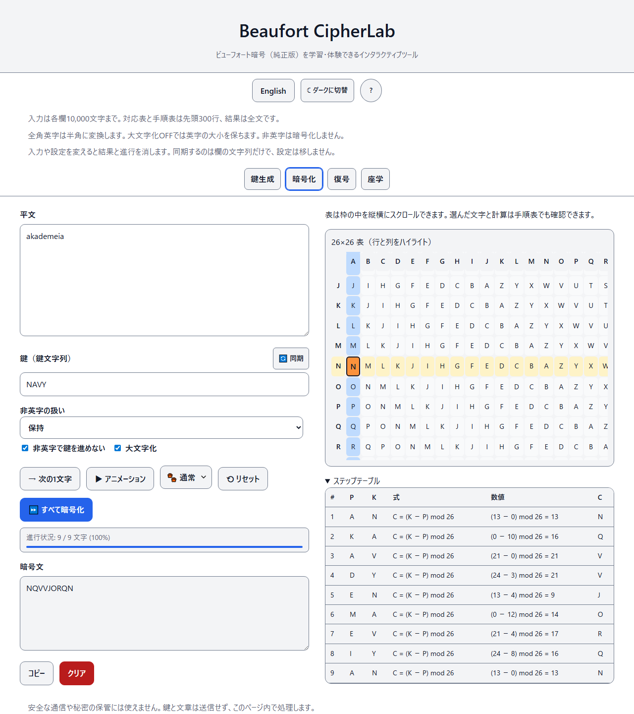
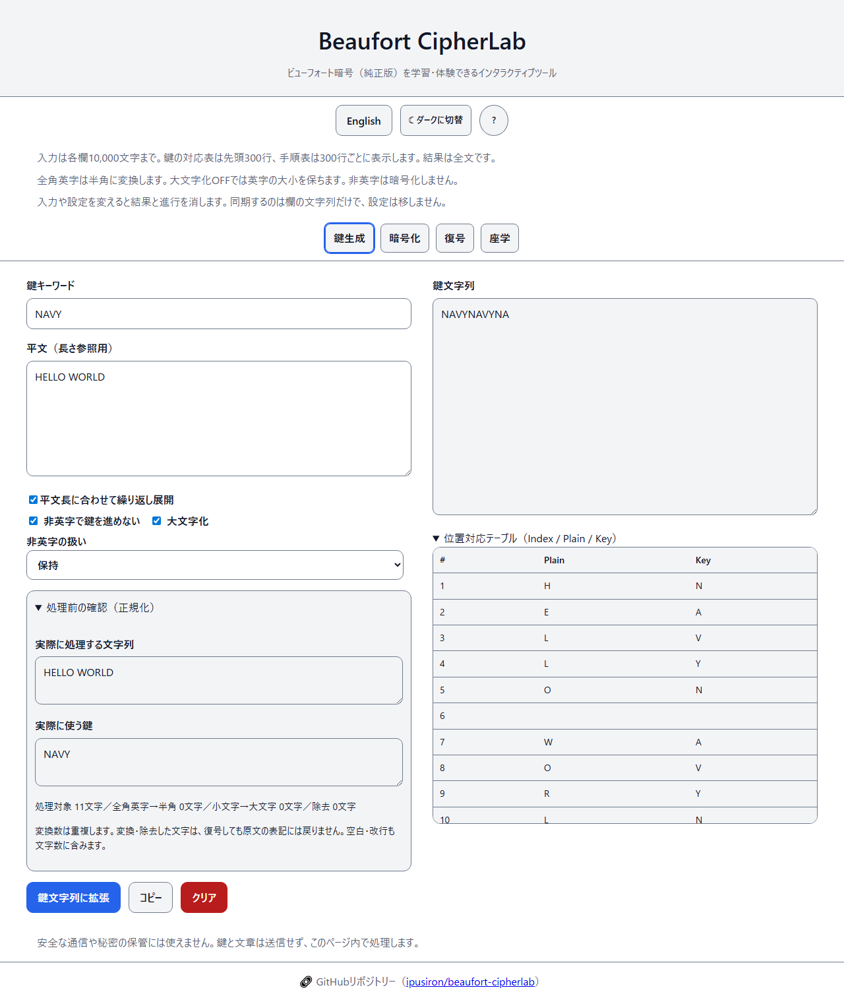
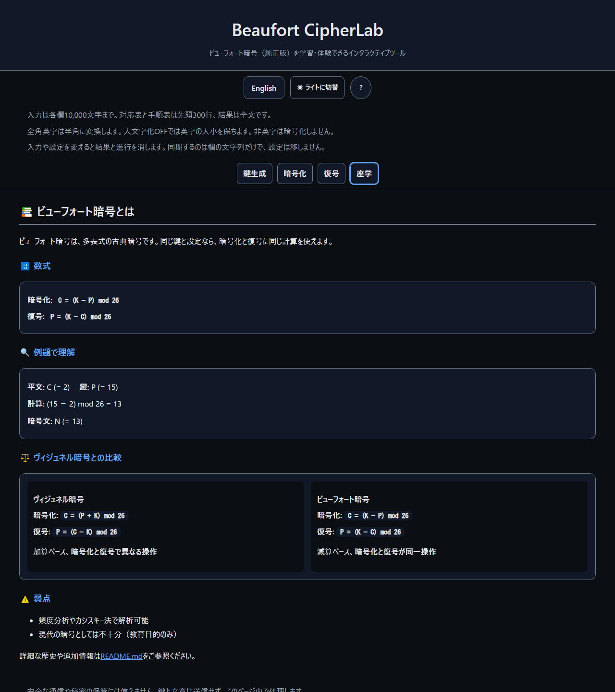

<!--
---
id: day078
slug: beaufort-cipherlab

title: "Beaufort CipherLab"

subtitle_ja: "ビューフォート暗号ツール"
subtitle_en: "Beaufort Cipher Learning Tool"

description_ja: "純正ビューフォート暗号を学習・体験できるインタラクティブツール。鍵生成、暗号化、復号を可視化し、ヴィジュネル暗号との違いを理解できます。"
description_en: "Interactive web tool to learn and visualize the pure Beaufort cipher: key generation, encryption/decryption, and comparison with Vigenère."

category_ja:
  - 古典暗号
  - 換字式暗号
category_en:
  - Classical Cryptography
  - Substitution Cipher

difficulty: 4

tags:
  - beaufort
  - vigenere
  - cipher
  - classical-crypto
  - polyalphabetic
  - education
  - visualization
  - javascript

repo_url: "https://github.com/ipusiron/beaufort-cipherlab"
demo_url: "https://ipusiron.github.io/beaufort-cipherlab/"

hub: true
---
-->

# Beaufort CipherLab - ビューフォート暗号ツール

[English](README.en.md) · 日本語


[](https://ipusiron.github.io/beaufort-cipherlab/)

**Day078 - 生成AIで作るセキュリティツール100**

Beaufort CipherLabは、古典暗号の一種であるビューフォート暗号（純正版）を学習できるWebツールです。

鍵生成、暗号化、復号をインタラクティブに可視化し、ヴィジュネル暗号との違いを理解できます。
暗号化と復号で同じ形式の数式を使う自己逆関数的な性質をアニメーションで体感できます。

---

## 🌐 デモページ

👉 **[https://ipusiron.github.io/beaufort-cipherlab/](https://ipusiron.github.io/beaufort-cipherlab/)**

ブラウザーで直接お試しいただけます。

---

## 📸 スクリーンショット


> *akademeiaを鍵NAVYで暗号化し、NQVVJORQNを得る画面。*


> *HELLO WORLDの空白では鍵を進めず、対応する鍵の位置を確認する画面。*


> *暗号化と復号の式を、ヴィジュネル暗号と比べる画面。*

---

## 🔐 ビューフォート暗号

ビューフォート暗号は、鍵の文字によって換字表を切り替える多表式の古典暗号です。
本ツールは `C = (K - P) mod 26` の方式を扱い、同じ鍵と設定で暗号化と復号を行えます。
教育用であり、秘密の保管や安全な通信には使えません。

### 歴史的背景

名称はFrancis Beaufort提督に由来します。
Helen Fouché Gainesの『Elementary Cryptanalysis』（1939年）は、同じ表でも読む向きによって「true Beaufort」と「variant Beaufort」を区別しています。
本ツールの「純正版」は前者を指し、歴史上の優劣を意味しません。
[原文の表と例題](https://www.gutenberg.org/files/75074/75074-h/75074-h.htm)を参照できます。

### ビューフォート vs. ボーフォート

英語の名称は「Beaufort cipher」です。
日本語には「ビューフォート暗号」「ボーフォート暗号」の表記があり、本ツールでは「ビューフォート暗号」に統一しています。

---

## ⚙️ ビューフォート暗号の仕組み

平文、鍵、暗号文を1文字ずつ対応させて処理します。
A=0からZ=25までの数値を使います。

- P：平文の1文字
- K：鍵の1文字。キーワードを必要な長さまで繰り返したもの
- C：暗号文の1文字

キーワードが `PACIFIC` で平文が英字20文字なら、鍵は `PACIFICPACIFICPACIFI` です。
記号や空白の位置で鍵を進めるかどうかは、画面の設定に従います。

### 表Aを使った説明

この表は、通常のアルファベットをずらして並べたものです。
左右と上下の端にAを重ねて27文字ずつ示しています。
画面で使う表Bとは読み方が異なります。

- 左端で平文Pを探す
- その行を横にたどって鍵Kを探す
- 見つかった列の上端を暗号文Cとして読む
- 平文と鍵が同じなら、左端と右端のどちらを使っても上端はA

| A | B | C | D | E | F | G | H | I | J | K | L | M | N | O | P | Q | R | S | T | U | V | W | X | Y | Z | A |
|---|---|---|---|---|---|---|---|---|---|---|---|---|---|---|---|---|---|---|---|---|---|---|---|---|---|---|
| B | C | D | E | F | G | H | I | J | K | L | M | N | O | P | Q | R | S | T | U | V | W | X | Y | Z | A | B |
| C | D | E | F | G | H | I | J | K | L | M | N | O | P | Q | R | S | T | U | V | W | X | Y | Z | A | B | C |
| D | E | F | G | H | I | J | K | L | M | N | O | P | Q | R | S | T | U | V | W | X | Y | Z | A | B | C | D |
| E | F | G | H | I | J | K | L | M | N | O | P | Q | R | S | T | U | V | W | X | Y | Z | A | B | C | D | E |
| F | G | H | I | J | K | L | M | N | O | P | Q | R | S | T | U | V | W | X | Y | Z | A | B | C | D | E | F |
| G | H | I | J | K | L | M | N | O | P | Q | R | S | T | U | V | W | X | Y | Z | A | B | C | D | E | F | G |
| H | I | J | K | L | M | N | O | P | Q | R | S | T | U | V | W | X | Y | Z | A | B | C | D | E | F | G | H |
| I | J | K | L | M | N | O | P | Q | R | S | T | U | V | W | X | Y | Z | A | B | C | D | E | F | G | H | I |
| J | K | L | M | N | O | P | Q | R | S | T | U | V | W | X | Y | Z | A | B | C | D | E | F | G | H | I | J |
| K | L | M | N | O | P | Q | R | S | T | U | V | W | X | Y | Z | A | B | C | D | E | F | G | H | I | J | K |
| L | M | N | O | P | Q | R | S | T | U | V | W | X | Y | Z | A | B | C | D | E | F | G | H | I | J | K | L |
| M | N | O | P | Q | R | S | T | U | V | W | X | Y | Z | A | B | C | D | E | F | G | H | I | J | K | L | M |
| N | O | P | Q | R | S | T | U | V | W | X | Y | Z | A | B | C | D | E | F | G | H | I | J | K | L | M | N |
| O | P | Q | R | S | T | U | V | W | X | Y | Z | A | B | C | D | E | F | G | H | I | J | K | L | M | N | O |
| P | Q | R | S | T | U | V | W | X | Y | Z | A | B | C | D | E | F | G | H | I | J | K | L | M | N | O | P |
| Q | R | S | T | U | V | W | X | Y | Z | A | B | C | D | E | F | G | H | I | J | K | L | M | N | O | P | Q |
| R | S | T | U | V | W | X | Y | Z | A | B | C | D | E | F | G | H | I | J | K | L | M | N | O | P | Q | R |
| S | T | U | V | W | X | Y | Z | A | B | C | D | E | F | G | H | I | J | K | L | M | N | O | P | Q | R | S |
| T | U | V | W | X | Y | Z | A | B | C | D | E | F | G | H | I | J | K | L | M | N | O | P | Q | R | S | T |
| U | V | W | X | Y | Z | A | B | C | D | E | F | G | H | I | J | K | L | M | N | O | P | Q | R | S | T | U |
| V | W | X | Y | Z | A | B | C | D | E | F | G | H | I | J | K | L | M | N | O | P | Q | R | S | T | U | V |
| W | X | Y | Z | A | B | C | D | E | F | G | H | I | J | K | L | M | N | O | P | Q | R | S | T | U | V | W |
| X | Y | Z | A | B | C | D | E | F | G | H | I | J | K | L | M | N | O | P | Q | R | S | T | U | V | W | X |
| Y | Z | A | B | C | D | E | F | G | H | I | J | K | L | M | N | O | P | Q | R | S | T | U | V | W | X | Y |
| Z | A | B | C | D | E | F | G | H | I | J | K | L | M | N | O | P | Q | R | S | T | U | V | W | X | Y | Z |
| A | B | C | D | E | F | G | H | I | J | K | L | M | N | O | P | Q | R | S | T | U | V | W | X | Y | Z | A |

平文 `C`（2）、鍵 `P`（15）なら、上端は `N`（13）です。
計算でも `(15 - 2) mod 26 = 13` となります。

### 表Bを使った説明

画面はこの表を使います。
行が鍵K、列が入力文字P、交点が暗号文Cです。
A行は `A Z Y X … B` で、各行の先頭は鍵の文字になります。

|   | A | B | C | D | E | F | G | H | I | J | K | L | M | N | O | P | Q | R | S | T | U | V | W | X | Y | Z |
|---|---|---|---|---|---|---|---|---|---|---|---|---|---|---|---|---|---|---|---|---|---|---|---|---|---|---|
| A | A | Z | Y | X | W | V | U | T | S | R | Q | P | O | N | M | L | K | J | I | H | G | F | E | D | C | B |
| B | B | A | Z | Y | X | W | V | U | T | S | R | Q | P | O | N | M | L | K | J | I | H | G | F | E | D | C |
| C | C | B | A | Z | Y | X | W | V | U | T | S | R | Q | P | O | N | M | L | K | J | I | H | G | F | E | D |
| D | D | C | B | A | Z | Y | X | W | V | U | T | S | R | Q | P | O | N | M | L | K | J | I | H | G | F | E |
| E | E | D | C | B | A | Z | Y | X | W | V | U | T | S | R | Q | P | O | N | M | L | K | J | I | H | G | F |
| F | F | E | D | C | B | A | Z | Y | X | W | V | U | T | S | R | Q | P | O | N | M | L | K | J | I | H | G |
| G | G | F | E | D | C | B | A | Z | Y | X | W | V | U | T | S | R | Q | P | O | N | M | L | K | J | I | H |
| H | H | G | F | E | D | C | B | A | Z | Y | X | W | V | U | T | S | R | Q | P | O | N | M | L | K | J | I |
| I | I | H | G | F | E | D | C | B | A | Z | Y | X | W | V | U | T | S | R | Q | P | O | N | M | L | K | J |
| J | J | I | H | G | F | E | D | C | B | A | Z | Y | X | W | V | U | T | S | R | Q | P | O | N | M | L | K |
| K | K | J | I | H | G | F | E | D | C | B | A | Z | Y | X | W | V | U | T | S | R | Q | P | O | N | M | L |
| L | L | K | J | I | H | G | F | E | D | C | B | A | Z | Y | X | W | V | U | T | S | R | Q | P | O | N | M |
| M | M | L | K | J | I | H | G | F | E | D | C | B | A | Z | Y | X | W | V | U | T | S | R | Q | P | O | N |
| N | N | M | L | K | J | I | H | G | F | E | D | C | B | A | Z | Y | X | W | V | U | T | S | R | Q | P | O |
| O | O | N | M | L | K | J | I | H | G | F | E | D | C | B | A | Z | Y | X | W | V | U | T | S | R | Q | P |
| P | P | O | N | M | L | K | J | I | H | G | F | E | D | C | B | A | Z | Y | X | W | V | U | T | S | R | Q |
| Q | Q | P | O | N | M | L | K | J | I | H | G | F | E | D | C | B | A | Z | Y | X | W | V | U | T | S | R |
| R | R | Q | P | O | N | M | L | K | J | I | H | G | F | E | D | C | B | A | Z | Y | X | W | V | U | T | S |
| S | S | R | Q | P | O | N | M | L | K | J | I | H | G | F | E | D | C | B | A | Z | Y | X | W | V | U | T |
| T | T | S | R | Q | P | O | N | M | L | K | J | I | H | G | F | E | D | C | B | A | Z | Y | X | W | V | U |
| U | U | T | S | R | Q | P | O | N | M | L | K | J | I | H | G | F | E | D | C | B | A | Z | Y | X | W | V |
| V | V | U | T | S | R | Q | P | O | N | M | L | K | J | I | H | G | F | E | D | C | B | A | Z | Y | X | W |
| W | W | V | U | T | S | R | Q | P | O | N | M | L | K | J | I | H | G | F | E | D | C | B | A | Z | Y | X |
| X | X | W | V | U | T | S | R | Q | P | O | N | M | L | K | J | I | H | G | F | E | D | C | B | A | Z | Y |
| Y | Y | X | W | V | U | T | S | R | Q | P | O | N | M | L | K | J | I | H | G | F | E | D | C | B | A | Z |
| Z | Z | Y | X | W | V | U | T | S | R | Q | P | O | N | M | L | K | J | I | H | G | F | E | D | C | B | A |

復号では、列に暗号文Cを選び、交点を平文Pとして読みます。
たとえば鍵A、平文BならZで、同じ鍵AでZを処理するとBに戻ります。

### ヴィジュネル暗号表（参考）

ヴィジュネル暗号では、鍵の行と平文の列の交点を読みます。
この表の各セルは `(K + P) mod 26` です。

|   | A | B | C | D | E | F | G | H | I | J | K | L | M | N | O | P | Q | R | S | T | U | V | W | X | Y | Z |
|---|---|---|---|---|---|---|---|---|---|---|---|---|---|---|---|---|---|---|---|---|---|---|---|---|---|---|
| A | A | B | C | D | E | F | G | H | I | J | K | L | M | N | O | P | Q | R | S | T | U | V | W | X | Y | Z |
| B | B | C | D | E | F | G | H | I | J | K | L | M | N | O | P | Q | R | S | T | U | V | W | X | Y | Z | A |
| C | C | D | E | F | G | H | I | J | K | L | M | N | O | P | Q | R | S | T | U | V | W | X | Y | Z | A | B |
| D | D | E | F | G | H | I | J | K | L | M | N | O | P | Q | R | S | T | U | V | W | X | Y | Z | A | B | C |
| E | E | F | G | H | I | J | K | L | M | N | O | P | Q | R | S | T | U | V | W | X | Y | Z | A | B | C | D |
| F | F | G | H | I | J | K | L | M | N | O | P | Q | R | S | T | U | V | W | X | Y | Z | A | B | C | D | E |
| G | G | H | I | J | K | L | M | N | O | P | Q | R | S | T | U | V | W | X | Y | Z | A | B | C | D | E | F |
| H | H | I | J | K | L | M | N | O | P | Q | R | S | T | U | V | W | X | Y | Z | A | B | C | D | E | F | G |
| I | I | J | K | L | M | N | O | P | Q | R | S | T | U | V | W | X | Y | Z | A | B | C | D | E | F | G | H |
| J | J | K | L | M | N | O | P | Q | R | S | T | U | V | W | X | Y | Z | A | B | C | D | E | F | G | H | I |
| K | K | L | M | N | O | P | Q | R | S | T | U | V | W | X | Y | Z | A | B | C | D | E | F | G | H | I | J |
| L | L | M | N | O | P | Q | R | S | T | U | V | W | X | Y | Z | A | B | C | D | E | F | G | H | I | J | K |
| M | M | N | O | P | Q | R | S | T | U | V | W | X | Y | Z | A | B | C | D | E | F | G | H | I | J | K | L |
| N | N | O | P | Q | R | S | T | U | V | W | X | Y | Z | A | B | C | D | E | F | G | H | I | J | K | L | M |
| O | O | P | Q | R | S | T | U | V | W | X | Y | Z | A | B | C | D | E | F | G | H | I | J | K | L | M | N |
| P | P | Q | R | S | T | U | V | W | X | Y | Z | A | B | C | D | E | F | G | H | I | J | K | L | M | N | O |
| Q | Q | R | S | T | U | V | W | X | Y | Z | A | B | C | D | E | F | G | H | I | J | K | L | M | N | O | P |
| R | R | S | T | U | V | W | X | Y | Z | A | B | C | D | E | F | G | H | I | J | K | L | M | N | O | P | Q |
| S | S | T | U | V | W | X | Y | Z | A | B | C | D | E | F | G | H | I | J | K | L | M | N | O | P | Q | R |
| T | T | U | V | W | X | Y | Z | A | B | C | D | E | F | G | H | I | J | K | L | M | N | O | P | Q | R | S |
| U | U | V | W | X | Y | Z | A | B | C | D | E | F | G | H | I | J | K | L | M | N | O | P | Q | R | S | T |
| V | V | W | X | Y | Z | A | B | C | D | E | F | G | H | I | J | K | L | M | N | O | P | Q | R | S | T | U |
| W | W | X | Y | Z | A | B | C | D | E | F | G | H | I | J | K | L | M | N | O | P | Q | R | S | T | U | V |
| X | X | Y | Z | A | B | C | D | E | F | G | H | I | J | K | L | M | N | O | P | Q | R | S | T | U | V | W |
| Y | Y | Z | A | B | C | D | E | F | G | H | I | J | K | L | M | N | O | P | Q | R | S | T | U | V | W | X |
| Z | Z | A | B | C | D | E | F | G | H | I | J | K | L | M | N | O | P | Q | R | S | T | U | V | W | X | Y |

### 数式のみ

- 暗号化：`C = (K - P) mod 26`
- 復号：`P = (K - C) mod 26`

同じKを使えば、`K - (K - P) = P` となります。
ただし、除去した非英字や大文字化で失われた元の大小は復元できません。

---

## 🔢 多表式暗号とビューフォート暗号

同じ平文文字でも、対応する鍵文字が違えば出力が変わります。
各鍵文字の換字表は逆向きのアルファベットなので、通常のシーザー暗号の加算とは区別してください。
短い鍵の繰り返しは周期を持ち、頻度分析やカシスキー法による解析の手掛かりになります。
鍵を長くするだけで、現代的な安全性が保証されるわけではありません。

## 📐 ビューフォート暗号の数式

本ツールの方式は、暗号化が `K - P`、復号が `K - C`（いずれもmod 26）です。
`P - K` で暗号化するVariant Beaufortは実装していません。

### ヴィジュネル暗号とビューフォート暗号

足す対象と引く順序を区別すると、3方式の違いが分かります。

| 方式 | 暗号化 | 復号 |
|---|---|---|
| Vigenère | (P + K) mod 26 | (C - K) mod 26 |
| Beaufort | (K - P) mod 26 | (K - C) mod 26 |
| Variant Beaufort | (P - K) mod 26 | (C + K) mod 26 |

### ヴィジュネル暗号の特徴

平文に鍵を足して暗号化し、暗号文から鍵を引いて復号します。

### ビューフォート暗号の特徴

鍵から入力文字を引く操作を、暗号化と復号の両方に使います。

### 実用面での差異

同じ手順を使えることは学習や手計算に便利ですが、暗号の強さの保証にはなりません。
本ツールは、操作ミスの発生率や安全性を測定しません。

---

## 🖥️ 画面構成（タブ）

1. 鍵生成：キーワードを繰り返し、平文との位置対応を表示
2. 暗号化：一括実行、1文字ずつのステップ実行、アニメーション
3. 復号：暗号化と同じ式で復号し、鍵の行と暗号文の列を表示
4. 座学：数式、例題、ヴィジュネル暗号との違い、限界の説明

鍵生成の「鍵文字列」には位置合わせ用の空欄を含めません。
対応表では、鍵を進めない非英字の位置を空欄で示します。
「平文長に合わせて繰り返し展開」をOFFにすると、正規化したキーワードの文字数だけ展開します。
平文が空なら、正規化したキーワードを1回表示します。

「同期」は欄の文字列だけをコピーします。
他タブの設定は移さないため、暗号化と復号の非英字処理と鍵の進め方をそろえてください。
入力、設定、同期を変更すると、そのタブの結果と進行を消します。
クリアはそのタブの入力と結果を消しますが、コピー済みのクリップボードは消しません。
タブの切り替え、ページを隠す操作、ヘルプ表示、言語の切り替えでは再生を停止します。

暗号化タブの「学習用サンプル」を開くと、基本例（ACA）、折り返しと空白、全角英字と記号の3例を選べます。
選ぶと平文、鍵、設定を置き換えます。
「処理前の確認（正規化）」には、実際に使う文字列と鍵、変換数と除去数を表示します。
全角の小文字は半角化と大文字化の両方に数えるため、変換数は重複します。

「1文字戻る」「先頭へ戻る」「指定位置へ移動」で計算位置を選べます。
位置は正規化後の処理済み文字数で、0は先頭です。
手順表は300行ごとに切り替えられ、ページ切り替えだけでは出力や計算位置は変わりません。
戻る操作、位置の指定、ページ切り替えは再生を停止します。
手動でページを切り替えると先頭行を表示し、ステップ実行では現在行に追従します。
最後まで処理すると「次の1文字」と再生を無効にし、戻ると再び使えるようになります。
「先頭へ戻る」は入力を残して進行を0に戻し、「クリア」は入力と結果を消します。

「同じ鍵・設定で復号して照合」は、平文を最後まで暗号化し、復号タブの入力、鍵、設定を置き換えて復号します。
比較対象は正規化後の平文です。
原文、比較対象、復号結果を並べて表示します。
復号側の鍵や設定を変えて実行すると、最初に違う位置と前後8文字も確認できます。
前後表示では、最初に違う文字を枠で囲みます。
空白、改行、タブは名前で示し、文字がない位置は「末尾」と表示します。
向きを変える文字などの制御文字は、文字コード付きの名前で示します。
暗号化側の入力や設定を変えると比較対象を消し、復号途中は一致を判定しません。
変換前の表記や除去した文字を復元する機能ではなく、一致しても安全性や改ざんがないことの証明にはなりません。

---

## 📋 仕様詳細

### 共通仕様

- 対象英字：A–Zとa–z。全角英字は半角に変換
- 大文字化ON：ASCII英字を大文字へ変換
- 大文字化OFF：入力の英字の大小を出力にも保持
- 非英字の保持：空白、改行、日本語、絵文字などをそのまま出力
- 非英字の除去：英字だけを処理
- 空白のみ保持：英字と半角スペースU+0020だけを処理。改行、タブ、全角スペースは除去
- 鍵：全角英字を半角に変換し、英字だけを大文字で使用。英字のない鍵はエラー
- 鍵の進行：正規化した入力に対して適用。非英字を残す場合、その位置でも進めるかを選択
- 長さ：各入力欄はUnicodeコードポイントで10,000文字まで。超過時は切り捨てずエラー
- 結果：全文を表示しコピー可能。.txtのダウンロード機能はなし
- 保存：言語とテーマだけをlocalStorageに保存。利用不可でも動作
- 言語：`?lang=ja|en` → 保存した選択 → ブラウザーの言語（日本語以外は英語）
- テーマ：保存した選択を優先し、未設定ならOSの配色に従う

### 可視化

- 26×26表と見出しを表示。枠内の縦横スクロールと交点への追従
- 交点は色に加えて枠線で強調。選んだ文字と計算は手順表にも表示
- 鍵の対応表は先頭300行。手順表は処理済みの行を300行ごとに表示し、前後のページへ移動可能。結果の全文は省略しない
- アニメーションの待ち時間：遅い250ms、通常120ms、速い60ms。処理時間により実際の間隔は変動
- 一括実行とステップ実行は同じ計算結果を使用
- 完了通知の時間：入力の正規化、暗号計算、表示用DOMの更新を含む経過時間

### UI/UX

- 日本語と英語の切り替え、ライトとダークの切り替え
- タブ：左右矢印、Home、Endで移動。Tabで操作要素へ移動
- `Ctrl+Enter`／`Command+Enter`：表示中の暗号化または復号を一括実行
- `Space`：再生と一時停止、`→`：次の1文字、`←`：1文字戻る（入力欄やボタンなどにフォーカスがない場合）
- `Esc`：ヘルプを閉じる。ヘルプが閉じていれば表示中の暗号化または復号を先頭へ戻す
- `?`：ヘルプ（入力欄やボタンなどにフォーカスがない場合）
- コピー不可の場合は通知。結果欄を選択して手動でコピー可能

---

## 🎓 教育的ポイント

`C` を鍵 `P` で処理すると `N`、同じ鍵で `N` を処理すると `C` になります。
画面の行、列、交点と手順表の数値を比べて、引く順序を確かめられます。

### 活用例

このツールならではの使い方

- 暗号化と復号が同じ操作になることを確かめる（対合・暗号の授業）：ボーフォート暗号は、暗号化と復号がまったく同じ計算になる。HELLOを鍵KEYで暗号化するとDANZQになり、DANZQを同じ鍵KEYで暗号化すると（復号ではなく）HELLOに戻る。自分自身が逆になる（対合）ので、同じ手順で元に戻せることを確かめられる
- 各文字が「鍵−平文」の引き算だと確かめる（剰余・数式の授業）：各文字の暗号文は、鍵の文字から平文の文字を引いた余り（C＝(K−P) mod 26）で決まる。平文H（7）を鍵K（10）で暗号化すると、10−7＝3でDになる。鍵と平文を足すヴィジュネル暗号と違い、引き算で求めることを確かめられる
- 26×26＝676通りすべてが引き算と一致することを確かめる（網羅検査の授業）：平文1文字と鍵1文字のすべての組み合わせ676通りで、暗号文が(K−P) mod 26と一致し、同じ鍵で戻すと平文に戻る。表の全マスが1つの数式で説明できることを、全数で確かめられる

- 授業：手計算で求めた1文字の結果を、表と数式の両方で確認
- 自習：大文字化や非英字の扱いを変え、復号で戻せる範囲を比較
- パズル制作：答えと鍵が決まっている短い英字メッセージを作り、復号で検算
- プログラミング学習：公開された計算モジュールと既知解答で、自作実装を確認
- 他ツールとの比較：ヴィジュネル暗号と同じ入力と鍵を使い、演算の違いを確認

### 検算用の例

非英字除去、大文字化ONでの結果です。

| 平文 | 鍵 | 暗号文 |
|---|---|---|
| C | P | N |
| AK ADEMEIA | NAVY | NQVVJORQN |
| DCODE | KEY | HCKHA |
| CEQUALSKMINUSP | RECIPROCAL | PAMOPGWSODEKKT |
| SENDSUPPLIES | COMET | KKZBBIZXTLYW |

`DCODE` は[dCodeの例](https://www.dcode.fr/beaufort-cipher)、`CEQUALSKMINUSP` は[ACAの資料](https://www.cryptogram.org/downloads/aca.info/ciphers/Beaufort.pdf)、`SENDSUPPLIES` はGainesの例です。
自動テストでは、表の全マスとこれらの既知解答を検証します。

## 🔒 安全性と限界

文章と鍵はこのページ内で処理し、ネットワーク送信も保存もしません。
CSPの `connect-src 'none'` でページからの通信を制限し、外部ライブラリーは読み込みません。
ただし、ブラウザー拡張や共有端末から入力を守るものではありません。
この古典暗号に秘密情報を入力しないでください。

GitHub Pages上では、HTMLのmetaタグでフレーム埋め込み拒否を強制できません。
その制御が必要なら、HTTPレスポンスヘッダーを設定できる配信環境を使ってください。

## 📚 学術的根拠

- [Helen Fouché Gaines, *Elementary Cryptanalysis* (1939)](https://www.gutenberg.org/files/75074/75074-h/75074-h.htm)：BeaufortとVariantの表、読み方、例題
- [American Cryptogram Association, *Beaufort*](https://www.cryptogram.org/downloads/aca.info/ciphers/Beaufort.pdf)：鍵の繰り返しと既知解答
- [Ole Immanuel Franksen, “Babbage and cryptography. Or, the mystery of Admiral Beaufort's cipher” (1993), 35(4), 327–367](https://doi.org/10.1016/0378-4754(93)90063-Z)：Babbageの暗号解析とBeaufortとの関係に関する研究

Franksenの論文は書誌情報と公開抄録を確認しています。
本文の内容や暗号の発明者を確定する根拠としては扱っていません。

## 🔗 関連資料

- [Vigenere Cipher Tool（Day017）](https://ipusiron.github.io/vigenere-cipher-tool/)：ヴィジュネル暗号を試す別ツール。入力の自動受け渡しはなし
- [dCode Beaufort](https://www.dcode.fr/beaufort-cipher)：方式や解析の機能を持つ別ツール
- [CrypTool Beaufort](https://legacy.cryptool.org/en/cto/beaufort)：文字集合や非英字の扱いを設定できる別ツール

---


## 📁 ディレクトリー構造

```text
beaufort-cipherlab/
├── .github/workflows/test.yml
├── .nojekyll
├── index.html
├── LICENSE
├── README.md
├── README.en.md
├── CLAUDE.md
├── package.json
├── assets/
│   ├── screenshot.png
│   ├── screenshot-key.png
│   ├── screenshot-learn.png
│   └── en/
│       ├── screenshot.png
│       ├── screenshot-key.png
│       └── screenshot-learn.png
├── css/
│   └── style.css
├── js/
│   ├── preferences.js
│   ├── messages.js
│   ├── normalize.js
│   ├── beaufort.js
│   ├── learning.js
│   ├── visualize.js
│   ├── toaster.js
│   └── app.js
└── test/
    ├── core.test.js
    ├── learning.test.js
    ├── ui.test.js
    └── readme.test.js
```

`normalize.js` は正規化、`beaufort.js` は計算、`visualize.js` は表、`app.js` は操作状態を担当します。
`preferences.js` は初期設定、`messages.js` は日英の文言を管理します。
`learning.js`は正規化プレビュー、手順表の表示範囲、文字列比較、学習用サンプルを管理します。

## 💻 動作環境とテスト

ビルドや依存パッケージのインストールは不要です。
`index.html` をブラウザーで直接開くか、静的HTTPサーバーで配信してください。

```sh
python -m http.server 8000
```

自動テストはNode.js 22以上で実行します。

```sh
npm test
```

GitHub Actionsでもpushとpull_requestの両方で実行します。
Chromium、Microsoft Edge、FirefoxでHTTPとfile://を確認しています。
Safariとスマートフォン実機は未確認です。
コピーはブラウザーの権限と起動方法によって制限されることがあります。

## 📄 ライセンス

MIT License。詳細は[LICENSE](LICENSE)を参照してください。

---

## 🛠️ このツールについて

本ツールは、「生成AIで作るセキュリティツール100」プロジェクトの一環として開発されました。
このプロジェクトでは、AIの支援を活用しながら、セキュリティに関連するさまざまなツールを100日間にわたり制作、公開していく取り組みを行っています。

プロジェクトの詳細や他のツールについては、以下のページをご覧ください。

🔗 [生成AIで作るセキュリティツール100](https://akademeia.info/?page_id=42163)
